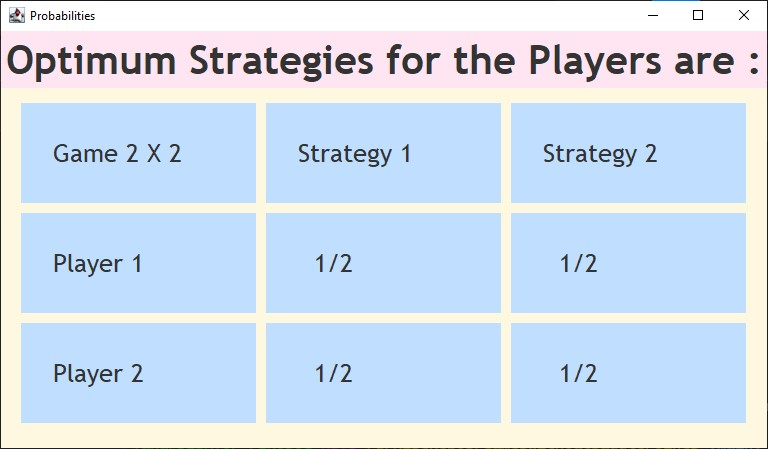

# Games Without Saddle Points

**GamesWithoutSaddlePoints** is a Java implementation of a simple, formula-based method to compute **Nash Equilibria** for **2×2** and **3×3** payoff matrices in two-player non-zero-sum games **without saddle points**.

The program returns the **ratios of optimal mixed strategies** for each player. For 3×3 games, it also includes a **one-time pure strategy dominance check** to reduce matrix size when possible.

## Features

- **2×2 Nash Equilibrium (Mixed Strategy)**:
  Uses standard closed-form formulas to compute optimal mixed strategies for both players.

- **3×3 Nash Equilibrium (Mixed Strategy)**:
  Computes strategy ratios via formula-based logic; includes support for reducing the game matrix using **pure strategy dominance** (checked once).

- **No Saddle Point Assumption**:
  Designed for games without pure strategy saddle points.

## How It Works

- Input: Two separate 2D arrays representing Player A and Player B's payoff matrices.
- Output: Ratios representing the players' optimal mixed strategies.

In 3×3 games, if a row or column is **strictly dominated**, it will be removed once before computing equilibria.

## Getting Started

### Requirements

- Java 8 or later
- No external dependencies

### Compilation & Execution

1. Compile:

   ```bash
   javac start.java
   ```

2. Run:

   ```bash
   java start
   ```

## Example (2×2)



